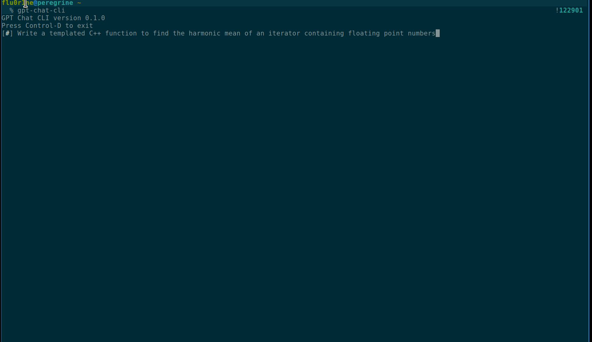

gpt-chat-cli: a simple yet powerful ChatGPT CLI
-----------------------------------------------

## Intro

`gpt-chat-cli` is a simple, general purpose ChatGPT CLI. It brings the power of ChatGPT to the command line. It aims to be easy to use and configurable.

Some of the features include:
- Streaming, real-time output
- Interactive sessions with color and adornments
- Support for any model which can be called through OpenAI's chat completions API.
  [See model endpoint compatibility.](https://platform.openai.com/docs/models/model-endpoint-compatibility)
- Modify model parameters including temperature, frequency penalty, presence penalty, top p, and the maximum number of tokens emitted
- Dynamic code syntax highlighting
- List available models
- Respects unix norms. Input can be gathered from pipes, heredoc, files, and arbitrary file descriptors.



### Installation:

```bash
pip install gpt-chat-cli
```

The OpenAI API uses API keys for authentication. Visit your [API Keys page](https://platform.openai.com/account/api-keys) to retrieve the API key you'll use in your requests. 
```bash
export OPENAI_API_KEY="INSERT_SECRET_KEY"
```

Then, source the `OPENAI_API_KEY` environmental variable in your shell's configuration file. (That is, `~/.bashrc` or `~/.zshrc` for the Bash or Zsh shell, respectively.)

```bash
source ~/.bashrc
```

### User guide

#### Usage:

```
usage: gpt-chat-cli [-h] [-m MODEL] [-t TEMPERATURE] [-f FREQUENCY_PENALTY] [-p PRESENCE_PENALTY] [-k MAX_TOKENS] [-s TOP_P] [-n N_COMPLETIONS] [--system-message SYSTEM_MESSAGE] [--adornments {on,off,auto}]
                    [--color {on,off,auto}] [--version] [-l] [-i] [--prompt-from-fd PROMPT_FROM_FD | --prompt-from-file PROMPT_FROM_FILE]
                    [message]

positional arguments:
  message               The contents of the message. When in a interactive session, this is the initial prompt provided.

options:
  -h, --help            show this help message and exit
  -m MODEL, --model MODEL
                        ID of the model to use
  -t TEMPERATURE, --temperature TEMPERATURE
                        What sampling temperature to use, between 0 and 2. Higher values like 0.8 will make the output more random, while lower values like 0.2 will make it more focused and deterministic.
  -f FREQUENCY_PENALTY, --frequency-penalty FREQUENCY_PENALTY
                        Number between -2.0 and 2.0. Positive values penalize new tokens based on their existing frequency in the text so far, decreasing the model's likelihood to repeat the same line verbatim.
  -p PRESENCE_PENALTY, --presence-penalty PRESENCE_PENALTY
                        Number between -2.0 and 2.0. Positive values penalize new tokens based on whether they appear in the text so far, increasing the model's likelihood to talk about new topics.
  -k MAX_TOKENS, --max-tokens MAX_TOKENS
                        The maximum number of tokens to generate in the chat completion. Defaults to 2048.
  -s TOP_P, --top-p TOP_P
                        An alternative to sampling with temperature, called nucleus sampling, where the model considers the results of the tokens with top_p probability mass. So 0.1 means only the tokens
                        comprising the top 10% probability mass are considered.
  -n N_COMPLETIONS, --n-completions N_COMPLETIONS
                        How many chat completion choices to generate for each input message.
  --system-message SYSTEM_MESSAGE
                        Specify an alternative system message.
  --adornments {on,off,auto}
                        Show adornments to indicate the model and response. Can be set to 'on', 'off', or 'auto'.
  --color {on,off,auto}
                        Set color to 'on', 'off', or 'auto'.
  --version             Print version and exit
  -l, --list-models     List models and exit
  -i, --interactive     Start an interactive session
  --prompt-from-fd PROMPT_FROM_FD
                        Obtain the initial prompt from the specified file descriptor
  --prompt-from-file PROMPT_FROM_FILE
                        Obtain the initial prompt from the specified file
```

#### Environmental Variables

Environmental variables can control default model parameters. They are overwritten by command-line parameters if specified.

| Environmental Variable | Controls | Default Value |
| --- | --- | --- |
| `GPT_CLI_MODEL` | ID of the model to use | "gpt-3.5-turbo" |
| `GPT_CLI_TEMPERATURE` | Sampling temperature to use, between 0 and 2 | 0.5 |
| `GPT_CLI_FREQUENCY_PENALTY` | Number between -2.0 and 2.0. Positive values penalize new tokens based on their existing frequency in the text so far | 0 |
| `GPT_CLI_PRESENCE_PENALTY` | Number between -2.0 and 2.0. Positive values penalize new tokens based on whether they appear in the text so far | 0 |
| `GPT_CLI_MAX_TOKENS` | The maximum number of tokens to generate in the chat completion | 2048 |
| `GPT_CLI_TOP_P` | An alternative to sampling with temperature, called nucleus sampling, where the model considers the results of the tokens with top_p probability mass | 1 |
| `GPT_CLI_N_COMPLETIONS` | How many chat completion choices to generate for each input message | 1 |
| `GPT_CLI_SYSTEM_MESSAGE` | Specify an alternative system message | See |
